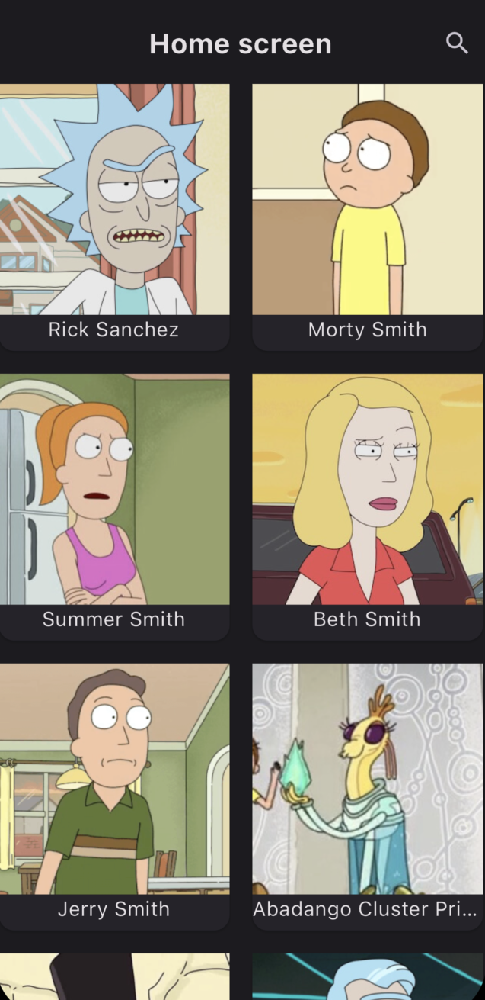
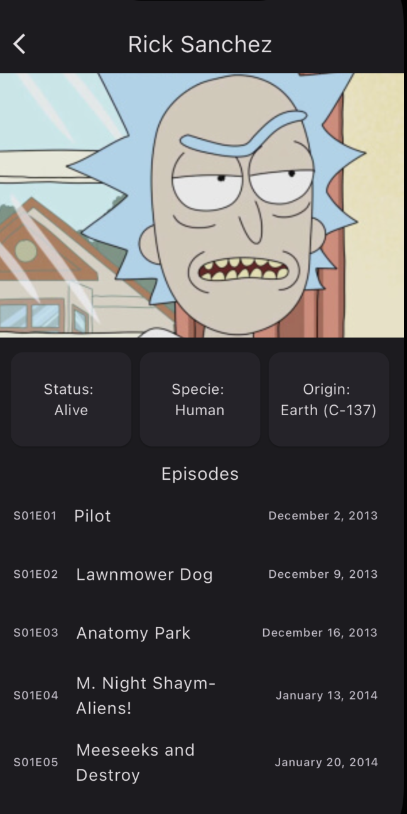
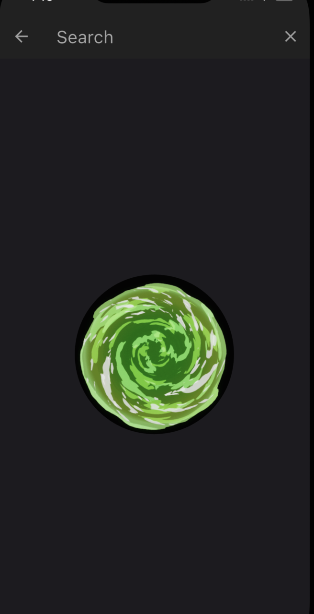
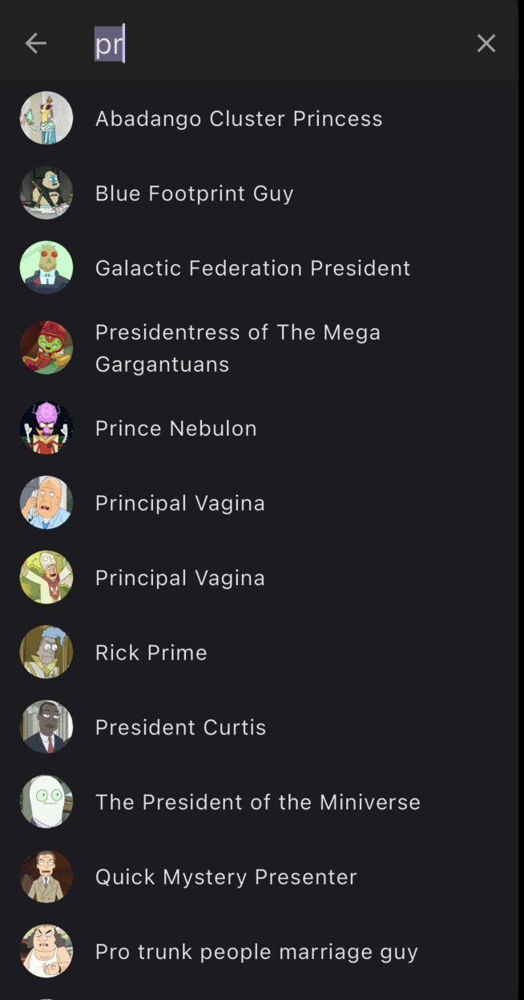

# rick_and_morty_app

A new Flutter project.

## Getting Started

This project is a starting point for a Flutter application.

A few resources to get you started if this is your first Flutter project:

- [Lab: Write your first Flutter app](https://docs.flutter.dev/get-started/codelab)
- [Cookbook: Useful Flutter samples](https://docs.flutter.dev/cookbook)

For help getting started with Flutter development, view the
[online documentation](https://docs.flutter.dev/), which offers tutorials,
samples, guidance on mobile development, and a full API reference.

---
<main style="display: grid; grid-template-columns: repeat(auto-fit, minmax(250px, 1fr)); place-content: center;">
  <figure>
    <figcaption style="font-weight: bold; font-size: 20px; margin-bottom: 1rem">Home page</figcaption>
    
  </figure>
  <figure>
    <figcaption style="font-weight: bold; font-size: 20px; margin-bottom: 1rem">Detail page</figcaption>
    
  </figure>
  <figure>
    <figcaption style="font-weight: bold; font-size: 20px; margin-bottom: 1rem">search loading</figcaption>
    
  </figure>
  <figure>
    <figcaption style="font-weight: bold; font-size: 20px; margin-bottom: 1rem">Search results</figcaption>
    
  </figure>
</main>
